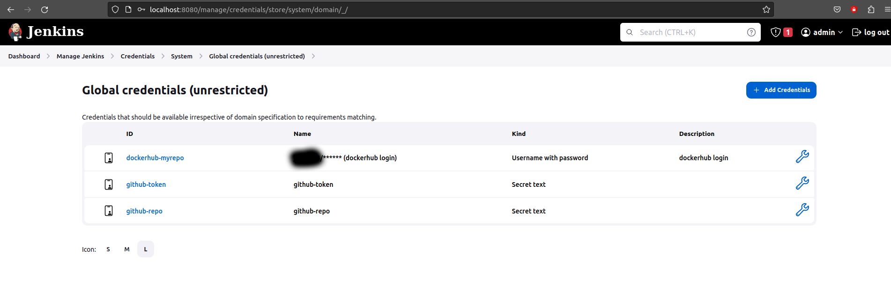
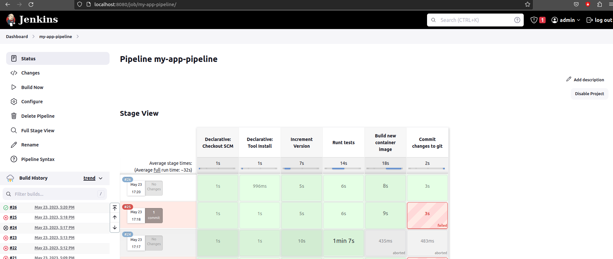

### Lecture 8 Jenkins

## Exercise 1 - Dockerization of node app
see [Dockerfile](Dockerfile)

## Exercise 2 - jenkins pipeline
1. install jenkins
2. configure jenkins
    * include nodejs (named node) to tools
    * install Pipeline Steps Utilities Plugin (for readJSON function)
    * add jenkins user to docker group (so it can connect to the docker.socket)
    * configure pipeline job
    * configure credentials
    
3. write jenkinsfile:
see [jenkinsfile](jenkinsfile)
4. execute pipeline (and after tons of failured jobs and debugging you finally manage to run it)



## Exercise 3 - Manual docker execution
1. deploy a droplet on digital ocean cloud
2. ssh into droplet
3. install docker (apt install -y docker.io)
4. run the following command
```
docker login
#enter credentials
docker pull <mydockerhubrepo>/my-node-app:1.1.0
docker run -p 3000:3000 -d <mydockerhubrepo>/my-node-app:1.1.0
```

## Exercise 4 - Shared Jenkins library
1. Create [shared library](https://github.com/jkrisch/devops-bootcamp-lecture-8-shared-lib) for jenkins.
2. Adjust jenkins file [jenkinsfile_sharedlib](./jenkinsfile_sharedlib)
3. Adjust jenkins pipeline and use new [jenkins file](./jenkinsfile_sharedlib)
